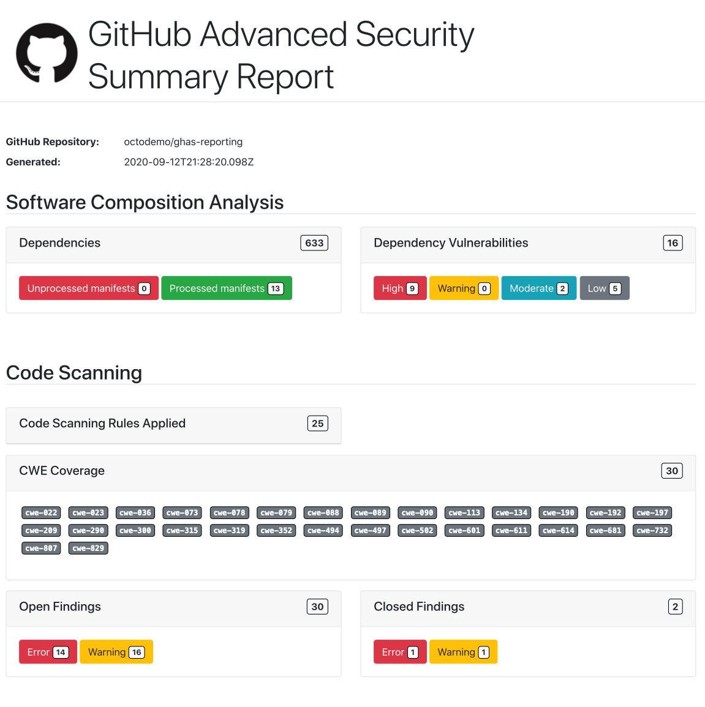

# github-security-report-action

A GitHub Action for generating PDF reports for GitHub Advanced Security Code Scan Results and Dependency Vulnerabilities.

The action comes with some predefined HTML templates using [Nunjucks](https://mozilla.github.io/nunjucks/templating.html),
along with the ability to in the future provide your own templates to the renderer.

Due to the nature of CodeQL Analysis this action ideally should be executed after the `github/codeql-action/analyze`
action step, as this will generate the SARIF files on the runner which can be used to identify ALL the rules that were
applied during the analysis. The results stored on your repository will only contain the results that generated an alert. 

## Processing

The action will use the provided token to load all the dependencies, dependency vulnerabilities and the Code Scanning
results for the specified repository. It will then look in the directory specified for any SARIF reports.

With this data it will construct a JSON payload that it then passes into the template system (using Nunjucks a Jinja 
like templating system for JavaScript) and will generate a Summary Report (with more of these to come in the future) 
providing a roll up summary security report in HTML.

Using this HTML, it then passes it over to Puppeteer to render this in a headless Chromium before generating a PDF and 
saving it in the specified directory.

## Parameters

* `token`: A GitHub Personal Access Token with access to `repo` scope
* `sarifReportDir`: The directory to look for SARIF reports (from the CodeQL analyze action this defaults to `../results`)
* `outputDir`: The output directory for the PDF reports, defaults to `github.workspace`
* `repository`: The repository in `<owner>/<repo_name>` form, defaults to `github.repository`


## Templates

Currently the templates are hard coded into the action. There are extension points built into the action that will allow
a future release to provide customization of these templates, via an ability to specify your own.


## Examples

```
name: Generate Security Report
uses: peter-murray/github-security-report-action@v2
with:
  token: ${{ secrets.SECURITY_TOKEN }}
```

Example summary report output:



## Future improvements

* Add support for selecting reporting templates to the parameters
* Example of extending html templates and using them
 
